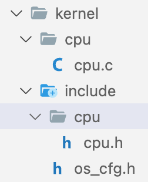
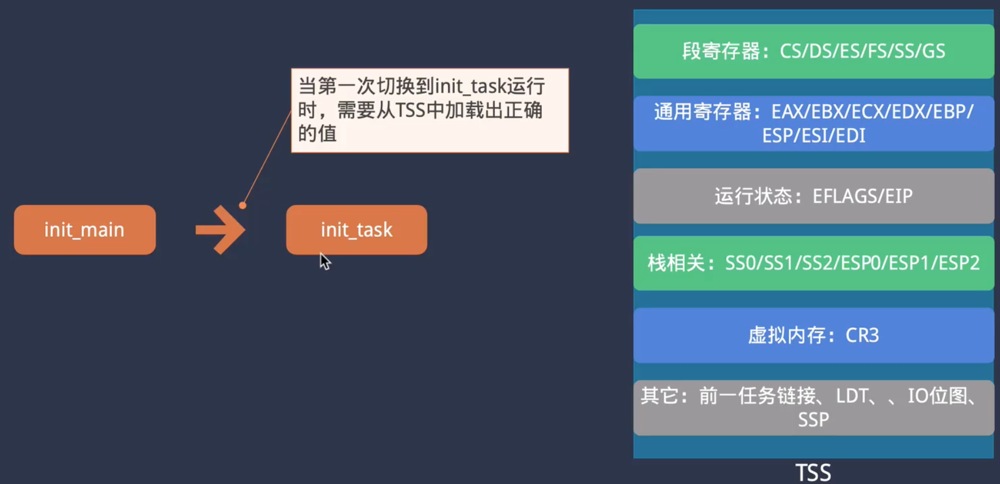

#### 计算机启动流程简介


#### 创建可引导的启动程序

开发流程


#### 初始化引导程序

我们设计的系统三个步骤（不同操作系统不一样）


BIOS只加载磁盘的第0个扇区到内存中，此部分程序无法做很多事情


因此，有两种方式，我们采取的是第二种


这些是段寄存器，为访问特定的内存地址，需要 采用段：偏移 的形式。但是我们设置寄存器的偏移量全为0


8086内存映射，实模式下，只能访问1MB


#### 使用BIOS中断显示字符

BIOS提供了一组服务，可以方便地帮助我们操纵硬件，避免与硬件细节打交道


中断向量表存储在0x0000 0000到0x 0000 03FF处，里面存储了不同中断处理函数的入口地址

当出发软中断时，会自动从中断向量表中去相应的地址执行，参数通过寄存器传递


*实战：*

```systemverilog
//像寄存器传递参数
mov $0xe, %ah
mov $'L', %al
//触发软中断
int $0x10
```

效果：qemu启动后成功显示字符 L


#### 使用BIOS中断程序读取磁盘

BIOS提供软磁盘读取多接口，方便我们从磁盘上读取loader


我们的loader位于boot后面的扇区（后文假设读取64个扇区），然后利用中断程序将这64个扇区读取到内存0x8000处（这个地址是自定义的）


INT13指令解释：


实战代码：

```
read_loader:
	// 读到内存的0x0080处
	mov $0x8000, %bx
	mov $0x2, %ah
	mov $0x2, %cx
	// 读取64个扇区
	mov $64, %al
	mov $0x0080, %dx
	int $0x13
	jc read_loader
```

disk.img第2个扇区（每个扇区512B，第二个扇区的起始地址为0x00000200）的前32个字节数据


代码执行完毕，我们在vscode的debug console查看内存地址0x8000的钱20个字节的数据，发现和磁盘文件disk.img中是一致的


#### 进入c语言并跳转到loader

在boot中添加

```
	//跳转到c代码
	jmp boot_entry
	jmp .
```

boot.c文件


为了让编译器知道0x8000处是一个函数，还需要在lau ch.json中添加


在script中吧对应的磁盘写入文件的注视打开，以便于把代码写入道磁盘中（方便qemu读取）


#### 利用内联汇编显示字符串

在loader_16.c下添加show_msg函数

```c
static void show_msg(const char* msg){
    char c;
    while((c=*msg++)!='\0'){
        __asm__ __volatile__(
            "mov $0xe, %%ah\n\t"
            "mov %[ch], %%al\n\t"
            "int $0x10"::[ch]"r"(c)
        );
    }
}
```

#### 检测内存容量

在comm目录下新建boot_info.h和types.h头文件，添加相关信息

在loader.h中添加SMAP_entry结构体

在loader_16.c中添加detect_memory函数

```c
// 参考：https://wiki.osdev.org/Memory_Map_(x86)
// 1MB以下比较标准, 在1M以上会有差别
// 检测：https://wiki.osdev.org/Detecting_Memory_(x86)#BIOS_Function:_INT_0x15.2C_AH_.3D_0xC7
static void  detect_memory(void) {
	uint32_t contID = 0;
	SMAP_entry_t smap_entry;
	int signature, bytes;

    show_msg("try to detect memory:");

	// 初次：EDX=0x534D4150,EAX=0xE820,ECX=24,INT 0x15, EBX=0（初次）
	// 后续：EAX=0xE820,ECX=24,
	// 结束判断：EBX=0
	boot_info.ram_region_count = 0;
	for (int i = 0; i < BOOT_RAM_REGION_MAX; i++) {
		SMAP_entry_t * entry = &smap_entry;

		__asm__ __volatile__("int  $0x15"
			: "=a"(signature), "=c"(bytes), "=b"(contID)
			: "a"(0xE820), "b"(contID), "c"(24), "d"(0x534D4150), "D"(entry));
		if (signature != 0x534D4150) {
            show_msg("failed.\r\n");
			return;
		}

		// todo: 20字节
		if (bytes > 20 && (entry->ACPI & 0x0001) == 0){
			continue;
		}

        // 保存RAM信息，只取32位，空间有限无需考虑更大容量的情况
        if (entry->Type == 1) {
            boot_info.ram_region_cfg[boot_info.ram_region_count].start = entry->BaseL;
            boot_info.ram_region_cfg[boot_info.ram_region_count].size = entry->LengthL;
            boot_info.ram_region_count++;
        }

		if (contID == 0) {
			break;
		}
	}
    show_msg("ok.\r\n");
}
```

#### 切换保护模式

cpu上电复位后默认进入实模式，在这种模式下没有保护机制，但提供了BIOS服务 

从实模式切换至保护模式需要遵循一定的流程


参考资料：

- 实模式：https://wiki.osdev.org/Real_Mode
- A20地址线：https://blog.csdn.net/sinolover/article/details/93877845


步骤：

- 关中断

- 打开A20地址线
- 加载GDT表

检查GDT表是否成功加载

在qemu中查看寄存器状态，info registers，可以看到GDTR寄存器中的数据，前32位是gdt表在内存中的地址，后16位是gdt表的大小（24的十六进制-1）因为是索引值，所以减1。

当前gdt表的内容：

```c
uint16_t gdt_table[][4] = {
    {0, 0, 0, 0},
    {0xFFFF, 0x0000, 0x9A00, 0x00CF},
    {0xFFFF, 0x0000, 0x9200, 0x00CF},
};
```

大小是3*8=24B。


可以看到vscode的调试信息中gdt_table的地址是0x9518，与GDT寄存器保持一致


- 设置CR0


- 远跳转

以上流程的代码实现代码实现 loader_16.c

```c
//进入保护模式
static void enter_protect_mode(void){
  //关中断
	cli();
	//开启A20地址线
	uint8_t v = inb(0x92);
	outb(0x92, v|0x2);
	//加载gdt表
	lgdt((uint32_t)gdt_table,sizeof(gdt_table));
	//设置CR0寄存器
 	uint32_t cr0=read_cr0();
	write_cr0(cr0|(1<<0));
	//远跳转
	far_jump(8,(uint32_t)protect_mode_entry);
}
```

#### 实用LBA模式读取磁盘


#### 创建内核工程

我们期望boot、loader、kernel在内存中的位置


具体处操作流程：

- Loader_32.c的load_kernel函数负责读取磁盘内容，并加载到0x10000处

```c
void load_kernel(void){
    //将内核放在loader后面
    read_disk(100,500,(uint8_t *)SYS_KERNEL_LOAD_ADDR);
	((void(*)(void))SYS_KERNEL_LOAD_ADDR)();   
}
```

- 0x10000对应kernel/init/start.S中_start的地址

```S
 	.text
	.extern kernel_init
	.global _start
_start:
	call kernel_init
	jmp .
```

- call 条状到kernel_init执行后续内容

```c
void kernel_init(void){
    
}
```

注意事项：

检查kernel加载位置是否正确，在vscode中查看内存地址0x100000处前20个字节的内容


发现与反汇编的机器码保持一致，说明加载正确

```dis
00100000 <_start>:
 	.text
	.extern kernel_init
	.global _start
_start:
	call kernel_init
  100000:	e8 02 00 00 00       	call   100007 <kernel_init>
	jmp .
  100005:	eb fe                	jmp    100005 <_start+0x5>

00100007 <kernel_init>:
#include "init.h"

void kernel_init(void){
  100007:	55                   	push   %ebp
  100008:	89 e5                	mov    %esp,%ebp
    
}
  10000a:	90                   	nop
  10000b:	5d                   	pop    %ebp
  10000c:	c3                   	ret
```

为了让编译器知道0x10000处是一个函数，还需要在lauch.json中添加


在script中吧对应的磁盘写入文件的注视打开，以便于把代码写入道磁盘中（方便qemu读取）

#### 向内核传递启动信息

- 将loader_16.c中boot_info_t boot_info的修饰词static去掉，因为要供外部使用
- loader.h中添加extern boot_info_t boot_info;
- 修改loader_32.c中load_kernel，向SYS_KERNEL_LOAD_ADDR处的函数传递参数

```c
void load_kernel(void){
    //将内核放在loader后面
    read_disk(100,500,(uint8_t *)SYS_KERNEL_LOAD_ADDR);
	((void (*)(boot_info_t *))SYS_KERNEL_LOAD_ADDR)(&boot_info);
}
```

- 修改SYS_KERNEL_LOAD_ADDR处的函数，即kernel/init/start.S

```s
 	.text
	.extern kernel_init
	.global _start

_start:
	# void start (boot_info_t * boot_info)	
	mov 4(%esp), %eax

	# void kernel_init(boot_info_t boot_info)
	push %eax
	call kernel_init
	jmp .
```

- 修改kernel_init的声明，以接受传递参数boot_info

```c
void kernel_init(boot_info_t boot_info){};
```

#### 代码数据段与链接脚本

代码段的存放位置


上面的数据变量参考如下图示


总结：


实战：

- 新建链接脚本文件 kernel.lds

```
SECTIONS{
		// 段的起始地址，这一点可以在elf文件中查看
    . = 0x100000;

    .text : {
         *(.text)
    }

    .rodata : {
        *(.rodata)
    }

    .data : {
        *(.data)
    }

    .bss : {
        *(.bss)
    }   
}
```

- cmake中修改链接脚本

```
set(CMAKE_EXE_LINKER_FLAGS "-m elf_i386  -T ${PROJECT_SOURCE_DIR}/kernel.lds")
```

验证：

在kernel_elf.txt中查看段信息，可以看到，.text的起始地址为00100000（我们的设置值）

```
Section Headers:
  [Nr] Name              Type            Addr     Off    Size   ES Flg Lk Inf Al
  [ 0]                   NULL            00000000 000000 000000 00      0   0  0
  [ 1] .text             PROGBITS        00100000 001000 000012 00  AX  0   0  1
```

#### 加载内核映像文件

我们之前的存储规划，kernel存放在内存地址0x100000处


因为我们当前的处理是把kernel/init目录下编译生成的文件转化为了二进制文件 （ -O binary）参数。

```c
add_custom_command(TARGET ${PROJECT_NAME}
                   POST_BUILD
                   COMMAND ${OBJCOPY_TOOL} -O binary ${PROJECT_NAME}.elf ${CMAKE_SOURCE_DIR}/../../image/${PROJECT_NAME}.elf
                   COMMAND ${OBJDUMP_TOOL} -x -d -S -m i386 ${PROJECT_BINARY_DIR}/${PROJECT_NAME}.elf > ${PROJECT_NAME}_dis.txt
                   COMMAND ${READELF_TOOL} -a ${PROJECT_BINARY_DIR}/${PROJECT_NAME}.elf > ${PROJECT_NAME}_elf.txt
)
```

这样做有一个坏处，二进制映像文件的内容是按程序最终在内存中的分布来组织的，如果我们设置其中一个段的地址非常大 ，如下图.data所示，这样会造成生产的kernel.elf文件变得非常大，但其中很大一部分都是零填充的，是无用信息。


因此我们可以采用elf文件格式，把 -O binary 参数去掉，加上-S （表示不需要添加调试信息，节省空间）

**elf文件加载过程**


新的存储规划，临时将kernel.elf读取到0x100000处，然后按照elf文件的读取规则读取到内存地址0x1000处


**操作步骤**

- 将kernel.lds中的起始地址改为0x10000
- 在kernel/init下新建elf.h描述elf文件的格式信息
- 修改launch.json中0x100000为0x10000,保证编译器正确跳转
- 修改load_32.c中load_kernel的启动流程

```c
void load_kernel(void){
    //将内核放在loader后面
    read_disk(100,500,(uint8_t *)SYS_KERNEL_LOAD_ADDR);

	 // 解析ELF文件，并通过调用的方式，进入到内核中去执行，同时传递boot参数
	 // 临时将elf文件先读到SYS_KERNEL_LOAD_ADDR处，再进行解析
    uint32_t kernel_entry = reload_elf_file((uint8_t *)SYS_KERNEL_LOAD_ADDR);
    if (kernel_entry == 0) {
      die(-1);
    }
    ((void (*)(boot_info_t *))kernel_entry)(&boot_info);
    for (;;) {}
}
```

#### GDT表的创建及其使用

GDT描述符的定义

```c
/**
 * GDT描述符
 */
typedef struct _segment_desc_t {
	uint16_t limit15_0;
	uint16_t base15_0;
	uint8_t base23_16; 
	uint16_t attr;
	uint8_t base31_24;
}segment_desc_t;
```


如下图所示，逻辑地址前16位会被当作段选择子，通过选择子查询GDT表，通过里面记录的段起始地址（同时还会做一些权限的校验）+ 后32位（offset）得到线性地址。线性地址再通过地址映射得到物理地址。


**实战步骤：**

- 新建文件及文件夹



Cpu.c

```c
#include "cpu/cpu.h"
#include "os_cfg.h"
#include "comm/cpu_instr.h"

static segment_desc_t gdt_table[GDT_TABLE_SIZE];

/**
 * 设置段描述符
 */
void segment_desc_set(int selector, uint32_t base, uint32_t limit, uint16_t attr) {
    segment_desc_t * desc = gdt_table + (selector >> 3);

	// 如果界限比较长，将长度单位换成4KB
	if (limit > 0xfffff) {
		attr |= SEG_G;
		limit /= 0x1000;
	}
	desc->limit15_0 = limit & 0xffff;
	desc->base15_0 = base & 0xffff;
	desc->base23_16 = (base >> 16) & 0xff;
	desc->attr = attr | (((limit >> 16) & 0xf) << 8);
	desc->base31_24 = (base >> 24) & 0xff;
}

void init_gdt(void) {
	// 全部清空
    for (int i = 0; i < GDT_TABLE_SIZE; i++) {
        segment_desc_set(i << 3, 0, 0, 0);
    }

	
//数据段
    segment_desc_set(KERNEL_SELECTOR_DS, 0x00000000, 0xFFFFFFFF,
                     SEG_P_PRESENT | SEG_DPL0 | SEG_S_NORMAL | SEG_TYPE_DATA
                     | SEG_TYPE_RW | SEG_D | SEG_G);

    // 只能用非一致代码段，以便通过调用门更改当前任务的CPL执行关键的资源访问操作
    segment_desc_set(KERNEL_SELECTOR_CS, 0x00000000, 0xFFFFFFFF,
                     SEG_P_PRESENT | SEG_DPL0 | SEG_S_NORMAL | SEG_TYPE_CODE
                     | SEG_TYPE_RW | SEG_D | SEG_G);

	lgdt((uint32_t)gdt_table,sizeof(gdt_table));
}

void cpu_init(void){
    init_gdt();
}
```

Cpu.h

```c
#ifndef CPU_H
#define CPU_H

#include "comm/types.h"

#pragma pack(1)

/**
 * GDT描述符
 */
typedef struct _segment_desc_t {
	uint16_t limit15_0;
	uint16_t base15_0;
	uint8_t base23_16;
	uint16_t attr;
	uint8_t base31_24;
}segment_desc_t;

#pragma pack()

#define SEG_G				(1 << 15)		// 设置段界限的单位，1-4KB，0-字节
#define SEG_D				(1 << 14)		// 控制是否是32位、16位的代码或数据段
#define SEG_P_PRESENT	    (1 << 7)		// 段是否存在

#define SEG_DPL0			(0 << 5)		// 特权级0，最高特权级
#define SEG_DPL3			(3 << 5)		// 特权级3，最低权限

#define SEG_S_SYSTEM		(0 << 4)		// 是否是系统段，如调用门或者中断
#define SEG_S_NORMAL		(1 << 4)		// 普通的代码段或数据段

#define SEG_TYPE_CODE		(1 << 3)		// 指定其为代码段
#define SEG_TYPE_DATA		(0 << 3)		// 数据段

#define SEG_TYPE_RW			(1 << 1)		// 是否可写可读，不设置为只读


#endif
```

Os_cfg.h

```c
#ifndef OS_CFG_H
#define OS_CFG_H

#define GDT_TABLE_SIZE 256

#define KERNEL_SELECTOR_CS (1*8)
#define KERNEL_SELECTOR_DS (2*8)

#endif
```

- 修改kernel/init/inti.c中kernel_init函数

```c
void kernel_init(boot_info_t boot_info){
    cpu_init(); //位于kernel/cpu/cpu.c中
}
```

- 修改kernel/init/start.S

```
#include "os_cfg.h" 


 	.text
	.extern kernel_init
	.global _start
	.extern init_main
_start:
	# void start (boot_info_t * boot_info)	
	mov 4(%esp), %eax

	# void kernel_init(boot_info_t boot_info)
	push %eax
	call kernel_init

	jmp $KERNEL_SELECTOR_CS, $gdt_reload

gdt_reload:
	//
	mov $KERNEL_SELECTOR_DS, %ax
	mov %ax, %ds
    mov %ax, %ss
    mov %ax, %es
    mov %ax, %fs
    mov %ax, %gs

	mov $(stack + KERNEL_STACK_SIZE), %esp
	jmp init_main

	.bss
.comm stack, KERNEL_STACK_SIZE
```

#### 触发异常与异常简介


IA-32下异常中断工255种，其中0-31被内部保留

#### 添加中断门描述符


根据Interrupt Gate的结构新建结构体，并存放于cpu.h下

```c
/*
 * 调用门描述符
 */
typedef struct _gate_desc_t {
	uint16_t offset15_0;
	uint16_t selector;
	uint16_t attr;
	uint16_t offset31_16;
}gate_desc_t;
```

中断处理流程


IDTR寄存器结构


新建kernel/include/cpu/irq.h

```c
#ifndef IRQ_H
#define IRQ_H

void irq_init(void);

#endif 
```

新建kernel/cpu/irq.c

```c
#include "cpu/irq.h"
#include "cpu/cpu.h"
#include "comm/cpu_instr.h"

#define IDT_TABLE_NR 128

static gate_desc_t idt_table[IDT_TABLE_NR];

void irq_init(void){
    for(int i=0;i<IDT_TABLE_NR;i++){
        gate_desc_set(idt_table+i,0,0,0);
    }
    lidt((uint32_t)idt_table,sizeof(idt_table));
}
```

#### 解析异常栈信息

跳转到中断处理函数前，会自动压入四个信息。


再加上我们的pusha和push压入的寄存器，栈中保存的信息如下。


此时，我们调用中断处理函数，相当于这些函数的形参有很多。为了解决这个问题，我们将这些参数封装成一个结构体存放于irq.h

```c
typedef struct _exception_frame_t {
    // 结合压栈的过程，以及pusha指令的实际压入过程
    int gs, fs, es, ds;
    int edi, esi, ebp, esp, ebx, edx, ecx, eax;
    // int num;
    // int error_code;
    int eip, cs, eflags;
}exception_frame_t;
```

我们在调用中断处理函数前还需要将这个结构体的地址（也就是esp指针）当作参数传递给函数，对应的函数签名：

```c
void do_handler_unknown (exception_frame_t * frame);
```


为达到以上效果的汇编代码：

```
	.text
	.extern do_handler_unknown
	.global exception_handler_unknown
exception_handler_unknown:
	// 保存所有寄存器
	pusha
	push %ds
	push %es
	push %fs
	push %gs

	// 调用中断处理函数
	push %esp
	call do_handler_unknown
	add $(1*4), %esp		// 丢掉esp

	// 恢复保存的寄存器
	pop %gs
	pop %fs
	pop %es
	pop %ds
	popa
	iret
```

在中断发生之前，硬件会自动将pc指针（eip）寄存器保存到栈中，接下来我们来验证。

```
void init_main(void) {
   10257:	55                   	push   %ebp
   10258:	89 e5                	mov    %esp,%ebp
   1025a:	83 ec 10             	sub    $0x10,%esp
    int a = 3 / 0;
   1025d:	b8 03 00 00 00       	mov    $0x3,%eax
   10262:	b9 00 00 00 00       	mov    $0x0,%ecx
   10267:	99                   	cltd
   10268:	f7 f9                	idiv   %ecx
   1026a:	89 45 fc             	mov    %eax,-0x4(%ebp)
    for (;;) {}
   1026d:	eb fe                	jmp    1026d <init_main+0x16>
```

init_main的反汇编代码中，10268对应的就是/0操作，当跳转到中断处理函数后，我们观察上面定义的结构体的信息。其中eip寄存器刚好是10268。


#### 利用宏重用异常处理代码

为了重用异常处理代码，我们将汇编代码写成宏的形式，放于kernel/init/start.S下

```
// 中断发生时，会自动切换到特权级0对应的栈中去执行
// 并且只保存ss,esp,cs,eip,flags寄存器
// 所以需要在中断中自行保存其它寄存器
   .text
.macro exception_handler name num with_error_code
	  .extern do_handler_\name
		.global exception_handler_\name
	exception_handler_\name:
		// 如果没有错误码，压入一个缺省值
		// 这样堆栈就和有错误码的情形一样了
		.if \with_error_code == 0
			push $0
		.endif

		// 压入异常号
		push $\num

		// 保存所有寄存器
		pushal
		push %ds
		push %es
		push %fs
		push %gs

		// 调用中断处理函数
		push %esp
		call do_handler_\name
		add $(1*4), %esp		// 丢掉esp

		// 恢复保存的寄存器
		pop %gs
		pop %fs
		pop %es
		pop %ds
		popal

		// 跳过压入的异常号和错误码
		add $(2*4), %esp
		iret
.endm
```

重新编辑结构体，压入错误码和向量号等信息，与上面汇编保持一致

```c
/**
 * 中断发生时相应的栈结构，暂时为无特权级发生的情况
 */
typedef struct _exception_frame_t {
    // 结合压栈的过程，以及pusha指令的实际压入过程
    int gs, fs, es, ds;
    int edi, esi, ebp, esp, ebx, edx, ecx, eax;
    int num;
    int error_code;
    int eip, cs, eflags;
}exception_frame_t;
```

声明中断处理函数

```c
typedef void(*irq_handler_t)(void);
```

安装中断或异常处理程序，为中断向量号为irq_num 的设置中断处理函数 handler

```c
/**
 * @brief 安装中断或异常处理程序
 */
int irq_install(int irq_num, irq_handler_t handler) {
	if (irq_num >= IDT_TABLE_NR) {
		return -1;
	}

    gate_desc_set(idt_table + irq_num, KERNEL_SELECTOR_CS, (uint32_t) handler,
                  GATE_P_PRESENT | GATE_DPL0 | GATE_TYPE_IDT);
	return 0;
}
```

在汇编代码下添加

```
exception_handler divider, 0, 0
```

就可以添加除0异常，然后通过

```c
irq_install(IRQ0_DE, (irq_handler_t)exception_handler_divider);
```

设置门描述符，（类似于中断向量表）

这样等发生中断，会先调用exception_handler_divider也就是汇编代码的入口地址，然后汇编代码调用do_handler_divider处理具体过程。

#### 处理其他类型的异常 

按照上述过程 处理

```c
// 中断号码
#define IRQ0_DE             0
#define IRQ1_DB             1
#define IRQ2_NMI            2
#define IRQ3_BP             3
#define IRQ4_OF             4
#define IRQ5_BR             5
#define IRQ6_UD             6
#define IRQ7_NM             7
#define IRQ8_DF             8
#define IRQ10_TS            10
#define IRQ11_NP            11
#define IRQ12_SS            12
#define IRQ13_GP            13
#define IRQ14_PF            14
#define IRQ16_MF            16
#define IRQ17_AC            17
#define IRQ18_MC            18
#define IRQ19_XM            19
#define IRQ20_VE            20
#define IRQ21_CP            21
```

#### 初始化中断控制器

- 上面的章节中中断 指的是异常，通常是由CPU内部事件所引起的中断，如程序出错（非法指令，地址越界，除0异常）。通常是由于执行了现行指令所引起的。
- 中断： 由外部设备，磁盘，键盘等。与现行指令无关


纯硬件细节，知道怎么设置即可

在irq.c配置初始化函数

```c
static void init_pic(void) {
    // 边缘触发，级联，需要配置icw4, 8086模式
    outb(PIC0_ICW1, PIC_ICW1_ALWAYS_1 | PIC_ICW1_ICW4);

    // 对应的中断号起始序号0x20
    outb(PIC0_ICW2, IRQ_PIC_START);

    // 主片IRQ2有从片
    outb(PIC0_ICW3, 1 << 2);

    // 普通全嵌套、非缓冲、非自动结束、8086模式
    outb(PIC0_ICW4, PIC_ICW4_8086);

    // 边缘触发，级联，需要配置icw4, 8086模式
    outb(PIC1_ICW1, PIC_ICW1_ICW4 | PIC_ICW1_ALWAYS_1);

    // 起始中断序号，要加上8
    outb(PIC1_ICW2, IRQ_PIC_START + 8);

    // 没有从片，连接到主片的IRQ2上
    outb(PIC1_ICW3, 2);

    // 普通全嵌套、非缓冲、非自动结束、8086模式
    outb(PIC1_ICW4, PIC_ICW4_8086);

    // 禁止所有中断, 允许从PIC1传来的中断
    outb(PIC0_IMR, 0xFF & ~(1 << 2));
    outb(PIC1_IMR, 0xFF);
}
```

在irq.h中配置相关宏。中断起始号为什么是0x20

```c
// PIC控制器相关的寄存器及位配置
#define PIC0_ICW1			0x20
#define PIC0_ICW2			0x21
#define PIC0_ICW3			0x21
#define PIC0_ICW4			0x21
#define PIC0_OCW2			0x20
#define PIC0_IMR			0x21

#define PIC1_ICW1			0xa0
#define PIC1_ICW2			0xa1
#define PIC1_ICW3			0xa1
#define PIC1_ICW4			0xa1
#define PIC1_OCW2			0xa0
#define PIC1_IMR			0xa1

#define PIC_ICW1_ICW4		(1 << 0)		// 1 - 需要初始化ICW4
#define PIC_ICW1_ALWAYS_1	(1 << 4)		// 总为1的位
#define PIC_ICW4_8086	    (1 << 0)        // 8086工作模式

#define IRQ_PIC_START		0x20			// PIC中断起始号
```

#### 中断的打开与关闭

中断开关分为两种，一个是全局的中断开关，另一个是8258芯片内部的 （irq.c)

```c
//局部，根据num打开或关闭
void irq_enable(int irq_num) {
    if (irq_num < IRQ_PIC_START) {
        return;
    }

    irq_num -= IRQ_PIC_START;
    if (irq_num < 8) {
        uint8_t mask = inb(PIC0_IMR) & ~(1 << irq_num);
        outb(PIC0_IMR, mask);
    } else {
        irq_num -= 8;
        uint8_t mask = inb(PIC1_IMR) & ~(1 << irq_num);
        outb(PIC1_IMR, mask);
    }
}

void irq_disable(int irq_num) {
    if (irq_num < IRQ_PIC_START) {
        return;
    }

    irq_num -= IRQ_PIC_START;
    if (irq_num < 8) {
        uint8_t mask = inb(PIC0_IMR) | (1 << irq_num);
        outb(PIC0_IMR, mask);
    } else {
        irq_num -= 8;
        uint8_t mask = inb(PIC1_IMR) | (1 << irq_num);
        outb(PIC1_IMR, mask);
    }
}
//全局开关中断开关
void irq_disable_global(void) {
    cli();
}

void irq_enable_global(void) {
    sti();
}
```

#### 启动定时器

- 新建dev/time.c time/h文件

```c
//
// https://wiki.osdev.org/Programmable_Interval_Timer
//

#include "dev/time.h"
#include "cpu/irq.h"
#include "comm/cpu_instr.h"
#include "os_cfg.h"

static uint32_t sys_tick;					// 系统启动后的tick数量

/**
 * 定时器中断处理函数
 */
void do_handler_timer (exception_frame_t *frame) {
    sys_tick++;

    // 先发EOI，而不是放在最后
    // 放最后将从任务中切换出去之后，除非任务再切换回来才能继续噢应
    pic_send_eoi(IRQ0_TIMER);
}

/**
 * 初始化硬件定时器
 */
static void init_pit (void) {
    uint32_t reload_count = PIT_OSC_FREQ / (1000.0 / OS_TICK_MS);

    outb(PIT_COMMAND_MODE_PORT, PIT_CHANNLE0 | PIT_LOAD_LOHI | PIT_MODE0);
    outb(PIT_CHANNEL0_DATA_PORT, reload_count & 0xFF);   // 加载低8位
    outb(PIT_CHANNEL0_DATA_PORT, (reload_count >> 8) & 0xFF); // 再加载高8位

    irq_install(IRQ0_TIMER, (irq_handler_t)exception_handler_timer);
    irq_enable(IRQ0_TIMER);
}

/**
 * 定时器初始化
 */
void time_init (void) {
    sys_tick = 0;

    init_pit();
}
```

```c
#ifndef TIMER_H
#define TIMER_H

#include "comm/types.h"

#define PIT_OSC_FREQ                1193182				// 定时器时钟

// 定时器的寄存器和各项位配置
#define PIT_CHANNEL0_DATA_PORT       0x40
#define PIT_COMMAND_MODE_PORT        0x43

#define PIT_CHANNLE0                (0 << 6)
#define PIT_LOAD_LOHI               (3 << 4)
#define PIT_MODE0                   (3 << 1)

void time_init (void);
void exception_handler_timer (void);

#endif //OS_TIMER_H
```


- 配置其他信息 ,在start.S中添加

```
// 硬件中断
exception_handler timer, 0x20, 0
```

- 测试： init.c. 一定要先打开全局中断 ，另外不要在for循环前加断电，这样可能导致进入不了time中断处理函数

```c
void init_main(void) {

    irq_enable_global();
    for (;;) {}
}
```

#### 配置字符串打印函数

新增kernel/tools/klib.c log.c  kernel/include/tools/klib.h log.h

klib.h

```c
#ifndef KLIB_H
#define KLIB_H

#include <stdarg.h>
#include "comm/types.h"

void kernel_strcpy (char * dest, const char * src);
void kernel_strncpy(char * dest, const char * src, int size);
int kernel_strncmp (const char * s1, const char * s2, int size);
int kernel_strlen(const char * str);
void kernel_memcpy (void * dest, void * src, int size);
void kernel_memset(void * dest, uint8_t v, int size);
int kernel_memcmp (void * d1, void * d2, int size);
void kernel_itoa(char * buf, int num, int base);
void kernel_sprintf(char * buffer, const char * fmt, ...);
void kernel_vsprintf(char * buffer, const char * fmt, va_list args);

#ifndef RELEASE
#define ASSERT(condition)    \
    if (!(condition)) panic(__FILE__, __LINE__, __func__, #condition)
void panic (const char * file, int line, const char * func, const char * cond);
#else
#define ASSERT(condition)    ((void)0)
#endif

#endif //KLIB_H

```

```c
#ifndef LOG_H
#define LOG_H

void log_init(void);
void log_printf(const char* fmt,...);

#endif
```

klib.c

```c
/**
 * 一些字符串的处理函数
 *
 * 创建时间：2022年8月5日
 * 作者：李述铜
 * 联系邮箱: 527676163@qq.com
 */
#include "tools/klib.h"
#include "tools/log.h"
#include "comm/cpu_instr.h"

void kernel_strcpy (char * dest, const char * src) {
    if (!dest || !src) {
        return;
    }

    while (*dest && *src) {
        *dest++ = *src++;
    }
    *dest = '\0';
}

void kernel_strncpy(char * dest, const char * src, int size) {
    if (!dest || !src || !size) {
        return;
    }

    char * d = dest;
    const char * s = src;

    while ((size-- > 0) && (*s)) {
        *d++ = *s++;
    }
    if (size == 0) {
        *(d - 1) = '\0';
    } else {
        *d = '\0';
    }
}

int kernel_strlen(const char * str) {
    if (str == (const char *)0) {
        return 0;
    }

	const char * c = str;

	int len = 0;
	while (*c++) {
		len++;
	}

	return len;
}

/**
 * 比较两个字符串，最多比较size个字符
 * 如果某一字符串提前比较完成，也算相同
 */
int kernel_strncmp (const char * s1, const char * s2, int size) {
    if (!s1 || !s2) {
        return -1;
    }

    while (*s1 && *s2 && (*s1 == *s2) && size) {
    	s1++;
    	s2++;
    }

    return !((*s1 == '\0') || (*s2 == '\0') || (*s1 == *s2));
}

void kernel_memcpy (void * dest, void * src, int size) {
    if (!dest || !src || !size) {
        return;
    }

    uint8_t * s = (uint8_t *)src;
    uint8_t * d = (uint8_t *)dest;
    while (size--) {
        *d++ = *s++;
    }
}

void kernel_memset(void * dest, uint8_t v, int size) {
    if (!dest || !size) {
        return;
    }

    uint8_t * d = (uint8_t *)dest;
    while (size--) {
        *d++ = v;
    }
}

int kernel_memcmp (void * d1, void * d2, int size) {
    if (!d1 || !d2) {
        return 1;
    }

	uint8_t * p_d1 = (uint8_t *)d1;
	uint8_t * p_d2 = (uint8_t *)d2;
	while (size--) {
		if (*p_d1++ != *p_d2++) {
			return 1;
		}
	}

	return 0;
}

void kernel_itoa(char * buf, int num, int base) {
    // 转换字符索引[-15, -14, ...-1, 0, 1, ...., 14, 15]
    static const char * num2ch = {"FEDCBA9876543210123456789ABCDEF"};
    char * p = buf;
    int old_num = num;

    // 仅支持部分进制
    if ((base != 2) && (base != 8) && (base != 10) && (base != 16)) {
        *p = '\0';
        return;
    }

    // 只支持十进制负数
    int signed_num = 0;
    if ((num < 0) && (base == 10)) {
        *p++ = '-';
        signed_num = 1;
    }

    if (signed_num) {
        do {
            char ch = num2ch[num % base + 15];
            *p++ = ch;
            num /= base;
        } while (num);
    } else {
        uint32_t u_num = (uint32_t)num;
        do {
            char ch = num2ch[u_num % base + 15];
            *p++ = ch;
            u_num /= base;
        } while (u_num);
    }
    *p-- = '\0';

    // 将转换结果逆序，生成最终的结果
    char * start = (!signed_num) ? buf : buf + 1;
    while (start < p) {
        char ch = *start;
        *start = *p;
        *p-- = ch;
        start++;
    }
}

/**
 * @brief 格式化字符串到缓存中
 */
void kernel_sprintf(char * buffer, const char * fmt, ...) {
    va_list args;

    va_start(args, fmt);
    kernel_vsprintf(buffer, fmt, args);
    va_end(args);
}

/**
 * 格式化字符串
 */
void kernel_vsprintf(char * buffer, const char * fmt, va_list args) {
    enum {NORMAL, READ_FMT} state = NORMAL;
    char ch;
    char * curr = buffer;
    while ((ch = *fmt++)) {
        switch (state) {
            // 普通字符
            case NORMAL:
                if (ch == '%') {
                    state = READ_FMT;
                } else {
                    *curr++ = ch;
                }
                break;
            // 格式化控制字符，只支持部分
            case READ_FMT:
                if (ch == 'd') {
                    int num = va_arg(args, int);
                    kernel_itoa(curr, num, 10);
                    curr += kernel_strlen(curr);
                } else if (ch == 'x') {
                    int num = va_arg(args, int);
                    kernel_itoa(curr, num, 16);
                    curr += kernel_strlen(curr);
                } else if (ch == 'c') {
                    char c = va_arg(args, int);
                    *curr++ = c;
                } else if (ch == 's') {
                    const char * str = va_arg(args, char *);
                    int len = kernel_strlen(str);
                    while (len--) {
                        *curr++ = *str++;
                    }
                }
                state = NORMAL;
                break;
        }
    }
}

void panic (const char * file, int line, const char * func, const char * cond) {
    log_printf("assert failed! %s", cond);
    log_printf("file: %s\nline %d\nfunc: %s\n", file, line, func);

    for (;;) {
        hlt();
    }
}
```

log.c

```c
#include <stdarg.h>
#include "comm/cpu_instr.h"
#include "tools/klib.h"
#include "tools/log.h"
#include "os_cfg.h"

// 目标用串口，参考资料：https://wiki.osdev.org/Serial_Ports
#define COM1_PORT           0x3F8       // RS232端口0初始化

/**
 * @brief 初始化日志输出
 */
void log_init (void) {
    outb(COM1_PORT + 1, 0x00);    // Disable all interrupts
    outb(COM1_PORT + 3, 0x80);    // Enable DLAB (set baud rate divisor)
    outb(COM1_PORT + 0, 0x03);    // Set divisor to 3 (lo byte) 38400 baud
    outb(COM1_PORT + 1, 0x00);    //                  (hi byte)
    outb(COM1_PORT + 3, 0x03);    // 8 bits, no parity, one stop bit
    outb(COM1_PORT + 2, 0xC7);    // Enable FIFO, clear them, with 14-byte threshold
  
    // If serial is not faulty set it in normal operation mode
    // (not-loopback with IRQs enabled and OUT#1 and OUT#2 bits enabled)
    outb(COM1_PORT + 4, 0x0F);
}

/**
 * @brief 日志打印
 */
void log_printf(const char * fmt, ...) {
    char str_buf[128];
    va_list args;

    kernel_memset(str_buf, '\0', sizeof(str_buf));

    va_start(args, fmt);
    kernel_vsprintf(str_buf, fmt, args);
    va_end(args);

    const char * p = str_buf;    
    while (*p != '\0') {
        while ((inb(COM1_PORT + 5) & (1 << 6)) == 0);
        outb(COM1_PORT, *p++);
    }

    outb(COM1_PORT, '\r');
    outb(COM1_PORT, '\n');
}

```


```sh
qemu-system-i386  -m 128M -s -S -serial stdio -drive file=disk1.dmg,index=0,media=disk,format=raw
```

-serial stdio的作用，是将字符串打印的位置重定向到终端

#### 添加任务状态段TSS

放在cpu.h下

```c
/**
 * Task-State Segment (TSS)
 */
typedef struct _tss_t {
    uint32_t pre_link;
    uint32_t esp0, ss0, esp1, ss1, esp2, ss2;
    uint32_t cr3;
    uint32_t eip, eflags, eax, ecx, edx, ebx, esp, ebp, esi, edi;
    uint32_t es, cs, ss, ds, fs, gs;
    uint32_t ldt;
    uint32_t iomap;
}tss_t;
```

执行流程	


因此，需要给每一个待运行的程序分配一个TSS结构，并且设置好初始值，以便第一次运行时加载正确的值。




存放于GDT表中的字段


可以看到和前面，所讲的GDT表的结构是一样的，因此可以复用前面的定义

```c
/**
 * GDT描述符 // TSS描述符
 */
typedef struct _segment_desc_t {
	uint16_t limit15_0;
	uint16_t base15_0;
	uint8_t base23_16; 
	uint16_t attr;
	uint8_t base31_24;
}segment_desc_t;
```

根据任务寄存器中的选择子定位GDT表中的TSS描述符，里面记录了当前任务的TSS信息。


