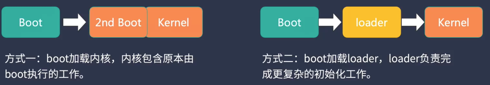
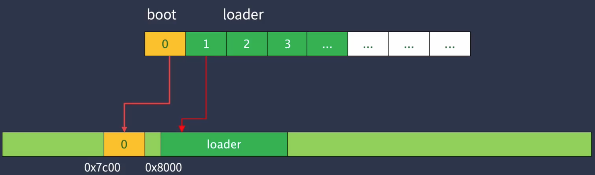
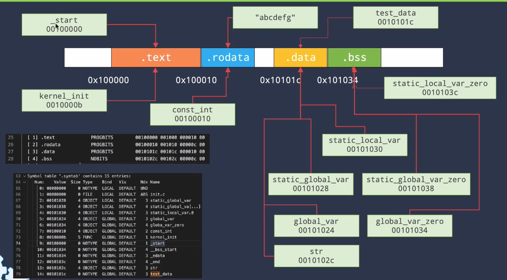

#### 计算机启动流程简介


#### 创建可引导的启动程序

开发流程


#### 初始化引导程序

我们设计的系统三个步骤（不同操作系统不一样）


BIOS只加载磁盘的第0个扇区到内存中，此部分程序无法做很多事情


因此，有两种方式，我们采取的是第二种



这些是段寄存器，为访问特定的内存地址，需要 采用段：偏移 的形式。但是我们设置寄存器的偏移量全为0


8086内存映射，实模式下，只能访问1MB


#### 使用BIOS中断显示字符

BIOS提供了一组服务，可以方便地帮助我们操纵硬件，避免与硬件细节打交道


中断向量表存储在0x0000 0000到0x 0000 03FF处，里面存储了不同中断处理函数的入口地址

当出发软中断时，会自动从中断向量表中去相应的地址执行，参数通过寄存器传递


*实战：*

```systemverilog
//像寄存器传递参数
mov $0xe, %ah
mov $'L', %al
//触发软中断
int $0x10
```

效果：qemu启动后成功显示字符 L


#### 使用BIOS中断程序读取磁盘

BIOS提供软磁盘读取多接口，方便我们从磁盘上读取loader


我们的loader位于boot后面的扇区（后文假设读取64个扇区），然后利用中断程序将这64个扇区读取到内存0x8000处（这个地址是自定义的）



INT13指令解释：


实战代码：

```
read_loader:
	// 读到内存的0x0080处
	mov $0x8000, %bx
	mov $0x2, %ah
	mov $0x2, %cx
	// 读取64个扇区
	mov $64, %al
	mov $0x0080, %dx
	int $0x13
	jc read_loader
```

disk.img第2个扇区（每个扇区512B，第二个扇区的起始地址为0x00000200）的前32个字节数据


代码执行完毕，我们在vscode的debug console查看内存地址0x8000的钱20个字节的数据，发现和磁盘文件disk.img中是一致的


#### 进入c语言并跳转到loader

在boot中添加

```
	//跳转到c代码
	jmp boot_entry
	jmp .
```

boot.c文件


为了让编译器知道0x8000处是一个函数，还需要在lau ch.json中添加


在script中吧对应的磁盘写入文件的注视打开，以便于把代码写入道磁盘中（方便qemu读取）


#### 利用内联汇编显示字符串

在loader_16.c下添加show_msg函数

```c
static void show_msg(const char* msg){
    char c;
    while((c=*msg++)!='\0'){
        __asm__ __volatile__(
            "mov $0xe, %%ah\n\t"
            "mov %[ch], %%al\n\t"
            "int $0x10"::[ch]"r"(c)
        );
    }
}
```

#### 检测内存容量

在comm目录下新建boot_info.h和types.h头文件，添加相关信息

在loader.h中添加SMAP_entry结构体

在loader_16.c中添加detect_memory函数

```c
// 参考：https://wiki.osdev.org/Memory_Map_(x86)
// 1MB以下比较标准, 在1M以上会有差别
// 检测：https://wiki.osdev.org/Detecting_Memory_(x86)#BIOS_Function:_INT_0x15.2C_AH_.3D_0xC7
static void  detect_memory(void) {
	uint32_t contID = 0;
	SMAP_entry_t smap_entry;
	int signature, bytes;

    show_msg("try to detect memory:");

	// 初次：EDX=0x534D4150,EAX=0xE820,ECX=24,INT 0x15, EBX=0（初次）
	// 后续：EAX=0xE820,ECX=24,
	// 结束判断：EBX=0
	boot_info.ram_region_count = 0;
	for (int i = 0; i < BOOT_RAM_REGION_MAX; i++) {
		SMAP_entry_t * entry = &smap_entry;

		__asm__ __volatile__("int  $0x15"
			: "=a"(signature), "=c"(bytes), "=b"(contID)
			: "a"(0xE820), "b"(contID), "c"(24), "d"(0x534D4150), "D"(entry));
		if (signature != 0x534D4150) {
            show_msg("failed.\r\n");
			return;
		}

		// todo: 20字节
		if (bytes > 20 && (entry->ACPI & 0x0001) == 0){
			continue;
		}

        // 保存RAM信息，只取32位，空间有限无需考虑更大容量的情况
        if (entry->Type == 1) {
            boot_info.ram_region_cfg[boot_info.ram_region_count].start = entry->BaseL;
            boot_info.ram_region_cfg[boot_info.ram_region_count].size = entry->LengthL;
            boot_info.ram_region_count++;
        }

		if (contID == 0) {
			break;
		}
	}
    show_msg("ok.\r\n");
}
```

#### 切换保护模式

cpu上电复位后默认进入实模式，在这种模式下没有保护机制，但提供了BIOS服务 

从实模式切换至保护模式需要遵循一定的流程


参考资料：

- 实模式：https://wiki.osdev.org/Real_Mode
- A20地址线：https://blog.csdn.net/sinolover/article/details/93877845


步骤：

- 关中断

- 打开A20地址线
- 加载GDT表

检查GDT表是否成功加载

在qemu中查看寄存器状态，info registers，可以看到GDTR寄存器中的数据，前32位是gdt表在内存中的地址，后16位是gdt表的大小（24的十六进制-1）因为是索引值，所以减1。

当前gdt表的内容：

```c
uint16_t gdt_table[][4] = {
    {0, 0, 0, 0},
    {0xFFFF, 0x0000, 0x9A00, 0x00CF},
    {0xFFFF, 0x0000, 0x9200, 0x00CF},
};
```

大小是3*8=24B。


可以看到vscode的调试信息中gdt_table的地址是0x9518，与GDT寄存器保持一致


- 设置CR0


- 远跳转

以上流程的代码实现代码实现 loader_16.c

```c
//进入保护模式
static void enter_protect_mode(void){
  //关中断
	cli();
	//开启A20地址线
	uint8_t v = inb(0x92);
	outb(0x92, v|0x2);
	//加载gdt表
	lgdt((uint32_t)gdt_table,sizeof(gdt_table));
	//设置CR0寄存器
 	uint32_t cr0=read_cr0();
	write_cr0(cr0|(1<<0));
	//远跳转
	far_jump(8,(uint32_t)protect_mode_entry);
}
```

#### 实用LBA模式读取磁盘


#### 创建内核工程

我们期望boot、loader、kernel在内存中的位置


具体处操作流程：

- Loader_32.c的load_kernel函数负责读取磁盘内容，并加载到0x10000处

```c
void load_kernel(void){
    //将内核放在loader后面
    read_disk(100,500,(uint8_t *)SYS_KERNEL_LOAD_ADDR);
	((void(*)(void))SYS_KERNEL_LOAD_ADDR)();   
}
```

- 0x10000对应kernel/init/start.S中_start的地址

```S
 	.text
	.extern kernel_init
	.global _start
_start:
	call kernel_init
	jmp .
```

- call 条状到kernel_init执行后续内容

```c
void kernel_init(void){
    
}
```

注意事项：

检查kernel加载位置是否正确，在vscode中查看内存地址0x100000处前20个字节的内容


发现与反汇编的机器码保持一致，说明加载正确

```dis
00100000 <_start>:
 	.text
	.extern kernel_init
	.global _start
_start:
	call kernel_init
  100000:	e8 02 00 00 00       	call   100007 <kernel_init>
	jmp .
  100005:	eb fe                	jmp    100005 <_start+0x5>

00100007 <kernel_init>:
#include "init.h"

void kernel_init(void){
  100007:	55                   	push   %ebp
  100008:	89 e5                	mov    %esp,%ebp
    
}
  10000a:	90                   	nop
  10000b:	5d                   	pop    %ebp
  10000c:	c3                   	ret
```

为了让编译器知道0x10000处是一个函数，还需要在lauch.json中添加


在script中吧对应的磁盘写入文件的注视打开，以便于把代码写入道磁盘中（方便qemu读取）

#### 向内核传递启动信息

- 将loader_16.c中boot_info_t boot_info的修饰词static去掉，因为要供外部使用
- loader.h中添加extern boot_info_t boot_info;
- 修改loader_32.c中load_kernel，向SYS_KERNEL_LOAD_ADDR处的函数传递参数

```c
void load_kernel(void){
    //将内核放在loader后面
    read_disk(100,500,(uint8_t *)SYS_KERNEL_LOAD_ADDR);
	((void (*)(boot_info_t *))SYS_KERNEL_LOAD_ADDR)(&boot_info);
}
```

- 修改SYS_KERNEL_LOAD_ADDR处的函数，即kernel/init/start.S

```s
 	.text
	.extern kernel_init
	.global _start

_start:
	# void start (boot_info_t * boot_info)	
	mov 4(%esp), %eax

	# void kernel_init(boot_info_t boot_info)
	push %eax
	call kernel_init
	jmp .
```

- 修改kernel_init的声明，以接受传递参数boot_info

```c
void kernel_init(boot_info_t boot_info){};
```

#### 代码数据段与链接脚本

代码段的存放位置



上面的数据变量参考如下图示


总结：


实战：

- 新建链接脚本文件 kernel.lds

```
SECTIONS{
		// 段的起始地址，这一点可以在elf文件中查看
    . = 0x100000;

    .text : {
         *(.text)
    }

    .rodata : {
        *(.rodata)
    }

    .data : {
        *(.data)
    }

    .bss : {
        *(.bss)
    }   
}
```

- cmake中修改链接脚本

```
set(CMAKE_EXE_LINKER_FLAGS "-m elf_i386  -T ${PROJECT_SOURCE_DIR}/kernel.lds")
```

验证：

在kernel_elf.txt中查看段信息，可以看到，.text的起始地址为00100000（我们的设置值）

```
Section Headers:
  [Nr] Name              Type            Addr     Off    Size   ES Flg Lk Inf Al
  [ 0]                   NULL            00000000 000000 000000 00      0   0  0
  [ 1] .text             PROGBITS        00100000 001000 000012 00  AX  0   0  1
```

